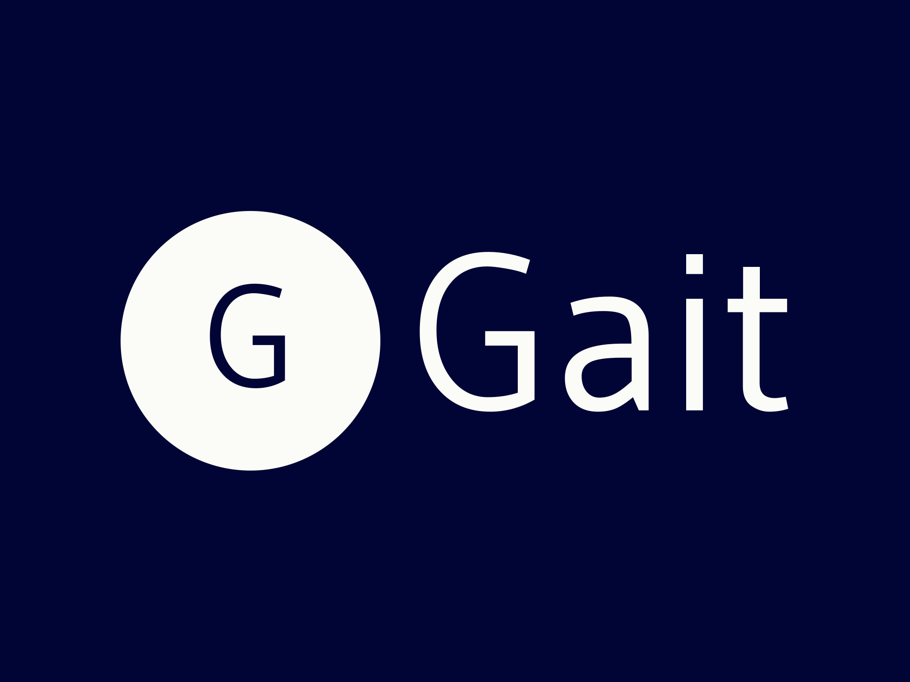

<div align="center">

  
  <h1>GAIT - GraphQL API Interactive Tool</h1>
  
  <p>
    GAIT Project is a full‑stack web application combining a modern React/Vite frontend with a robust Spring Boot backend. This project demonstrates a modular, containerized architecture with integrated services such as PostgreSQL, Blazegraph, and a Python‑based NLP microservice.
  </p>
  
  
<!-- Badges -->
<p>
  <a href="https://github.com/TudFilip/WADe-Project/graphs/contributors">
    
  </a>
  <a href="">
    
  </a>
  <a href="https://github.com/TudFilip/WADe-Project/network/members">
    
  </a>
  <a href="https://github.com/TudFilip/WADe-Project/stargazers">
    
  </a>
  <a href="https://github.com/TudFilip/WADe-Project/issues/">
    
  </a>
  <a href="https://github.com/TudFilip/WADe-Project/blob/master/LICENSE">
    
  </a>
</p>
   
<h4>
    <a href="https://github.com/TudFilip/WADe-Project">View Demo</a>
  <span> · </span>
    <a href="https://github.com/TudFilip/WADe-Project">Documentation</a>
  <span> · </span>
    <a href="https://github.com/TudFilip/WADe-Project/issues/">Report Bug</a>
  <span> · </span>
    <a href="https://github.com/TudFilip/WADe-Project/issues/">Request Feature</a>
  </h4>
</div>

<br />

<!-- Table of Contents -->

# :notebook_with_decorative_cover: Table of Contents

-   [About the Project](#star2-about-the-project)
    -   [Screenshots](#camera-screenshots)
    -   [Tech Stack](#space_invader-tech-stack)
    -   [Features](#dart-features)
    -   [Color Reference](#art-color-reference)
    -   [Environment Variables](#key-environment-variables)
-   [Getting Started](#toolbox-getting-started)
    -   [Prerequisites](#bangbang-prerequisites)
    -   [Run Locally](#running-run-locally)
-   [Usage](#eyes-usage)
-   [Roadmap](#compass-roadmap)
-   [FAQ](#grey_question-faq)
-   [License](#warning-license)
-   [Contact](#handshake-contact)
-   [Acknowledgements](#gem-acknowledgements)

<!-- About the Project -->

## :star2: About the Project

The GAIT is an innovative web‑based platform that streamlines how users interact with APIs through natural language. By translating everyday language into structured queries, GAIT eliminates the need for manual query writing, enabling users of all technical levels to access and manipulate data with ease.

At its core, WADe adopts a modern, service‑oriented architecture that seamlessly integrates multiple components:

-   **User Interface (UI):** Built with React, Vite, and Material UI, the UI offers a responsive, intuitive experience with features like dynamic theming, internationalization, and a chat‑inspired interaction model.
-   **Processing Layer:** Leveraging advanced natural language processing (NLP) techniques, this layer transforms user prompts into API requests, ensuring that even complex queries are handled accurately.
-   **API Integration Layer:** The backend, developed in Spring Boot, connects to essential services such as PostgreSQL for relational data, Blazegraph for graph data, and a dedicated Python‑based NLP microservice for enhanced language understanding.

The primary goal of the WADe Project is to democratize data access by allowing users to interact with sophisticated APIs using simple, natural language. This not only reduces the learning curve but also accelerates data-driven decision making across various domains.

<!-- Screenshots -->

### :camera: Screenshots

<div align="center"> 
  
  
  
  
</div>

<!-- TechStack -->

### :space_invader: Tech Stack

<details>
  <summary>Client</summary>
  <ul>
    <li><a href="https://www.typescriptlang.org/">Typescript</a></li>
    <li><a href="https://reactjs.org/">React.js</a></li>
    <li><a href="https://reactjs.org/">Vite</a></li>
    <li><a href="https://reactjs.org/">React Router</a></li>
    <li><a href="https://reactjs.org/">Material UI</a></li>
    <li><a href="https://reactjs.org/">Axios</a></li>
    <li><a href="https://reactjs.org/">React Cookie</a></li>
  </ul>
</details>

<details>
  <summary>Server</summary>
  <ul>
    <li><a href="https://www.typescriptlang.org/">Java</a></li>
    <li><a href="https://expressjs.com/">Spring Boot</a></li>
    <li><a href="https://go.dev/">Python</a></li>
    <li><a href="https://nestjs.com/">Flask</a></li>
    <li><a href="https://graphql.org/">GraphQL</a></li>
    <li><a href="https://go.dev/">SPARQL</a></li>
    <li><a href="https://www.apollographql.com/">OpenAI</a></li>
  </ul>
</details>

<details>
<summary>Database</summary>
  <ul>
    <li><a href="https://www.postgresql.org/">PostgreSQL</a></li>
    <li><a href="https://www.mysql.com/">Blazegraph</a></li>
    <li><a href="https://redis.io/">RDF Turtle</a></li>
  </ul>
</details>

<details>
<summary>DevOps</summary>
  <ul>
    <li><a href="https://www.docker.com/">Docker</a></li>
    <li><a href="https://www.jenkins.io/">Amazon EC2</a></li>
  </ul>
</details>

<!-- Features -->

### :dart: Features

-   **User Authentication:** Secure login functionality using encrypted credentials and session management.
-   **Responsive Design:** Optimized for mobile, tablet, and desktop for a seamless user experience.
-   **Natural Language Processing:** Converts plain text queries into structured API requests.
-   **Real-Time Query Processing:** Instant feedback and dynamic updates as users interact with the system.
-   **Multilingual Support:** Built-in internationalization with i18next, enabling multiple language options.
-   **Dynamic Theming:** Toggle between light and dark modes to suit user preferences.
-   **Conversation History:** Maintains a log of past queries and responses for easy reference.
-   **Interactive Sidebar Navigation:** Intuitive sidebar to quickly access and manage previous interactions.
-   **Containerized Deployment:** Fully Dockerized setup for consistent, scalable deployment across environments.
-   **Robust API Integration & Intelligent Caching:** Seamlessly connects to backend services (Spring Boot, PostgreSQL, Blazegraph, and NLP microservices) with an intelligent caching mechanism. Each prompt request and its response are stored in an RDF database (Blazegraph), so if a user sends the same request again, the response is retrieved instantly from the cache.

<!-- Color Reference -->

### :art: Color Reference

| Color           | Hex     |
| --------------- | ------- |
| Primary Color   | #221C35 |
| Secondary Color | #3A2B5F |
| Primary Color   | #7928CA |
| Secondary Color | #a62bc5 |
| Accent Color    | #FF0080 |
| Text Color      | #221C35 |

<!-- Env Variables -->

### :key: Environment Variables

To run this project, you will need to add a few .env files. The first one should be added into Backend/Java MicroService folder:

```dotenv
# Database credentials
POSTGRES_USER=postgres
POSTGRES_PASSWORD=postgres
POSTGRES_DB=GaitTST

# GitHub Token
GITHUB_TOKEN='YOUR_GITHUB_TOKEN'

# OpenAI Token
OPENAI_API_KEY='YOUR_OPENAI_TOKEN'

# JWT Secret
JWT_SECRET=CHANGE_THIS_TO_A_LONG_RANDOM_SECRET_STRING_ABC123

```

The second one should be added into Frontend folder:

```dotenv
VITE_API_PROTOCOL=http
VITE_API_HOSTNAME=127.0.0.1
VITE_API_PORT=8080
```

<!-- Getting Started -->

## :toolbox: Getting Started

<!-- Prerequisites -->

### :bangbang: Prerequisites

Frontend use Node.js v22.13.1 together with npm v10.9.2

```bash
>>> node --version
>>> v22.13.1
>>>
>>> npm --version
>>> 10.9.2
```

For Java MicroService you have to install the dependencies from pom.xml file and have Java SDK 20 installed on your machine.

For Python MicroService you have to install the desired dependencies from requirements.txt and have at least Python v3.8 installed on your machine.

```bash
>>> pip install -r ./requirements.txt
```

<!-- Run Locally -->

### :running: Run Locally

Clone the project

```bash
>>> git clone https://github.com/TudFilip/WADe-Project.git
```

Go to each project directory:

```bash
>>> cd Frontend
>>> cd Backend/Java MicroService
>>> cd Backend/Python MicroService
```

Install dependencies for each one. Be sure to have a valid OpenAI key and GitHub token and place them in the .env files as
mentioned above.

Since this project is dockerized, in order to start it you need to have docker installed locally, together with Docker Desktop application. You can check your version of docker with this:

```bash
>>> docker --version
>>> docker-compose --version
```

If everything is set, go to the root of Backend/Java MicroService and run:

```bash
>>> docker-componse up --build -d
```

After everything is set, in the Docker Desktop you should see, in Containers tab, 5 new created containers.

<div align="center"> 
  
</div>

<!-- Usage -->

## :eyes: Usage

This section provides a step-by-step guide on how to use the GAIT platform to interact with GraphQL APIs using natural language. Whether you're a developer, analyst, or enthusiast, GAIT makes it easy to fetch data from APIs like GitHub and more without writing complex GraphQL queries.

### **Simple User Flow**

1. **Log In or Create New Account**:

    - If you're a new user, go to the **Create New Account** page to create an account.
    - Existing users can log in using their credentials on the **Login** page.

2. **Send a Prompt**:

    - Once logged in, you enter **Home** page.
    - Enter your prompt in plain text.
    - Click **Send** to process your prompt.

3. **View Results**:

    - The system will process your prompt, generate a GraphQL query, and fetch the results from the relevant API.
    - Results will be displayed in a JSON format under your prompt message.

4. **Check Your Old Prompts And Answers**:
    - You can see your old queries and results on the left sidebar.
    - Access your saved queries and history by clicking on one of it.
    - You can see old results or even redo a prompt if you are curious.

### **Example Queries**

Here are some example queries you can try:

-   **GitHub**: "Which are the most starred repos of user Microsoft?"
-   **Countries API**: "What is the capital of Yemen?"

<!-- Roadmap -->

## :compass: Roadmap

-   [x] Define Core Features
-   [x] Tech Stack Decisions
-   [x] Design System Architecture
-   [x] Create Database Schema
-   [x] Define API Specifications
-   [x] UI/UX Design
-   [x] Develop Backend Services
-   [x] Develop Frontend Application
-   [x] Integration Testing
-   [x] Set Up Deployment Pipeline
-   [x] Multiple Languages Support
-   [x] Deploy Application
-   [x] Documentation
-   [ ] Unit Testing
-   [ ] Monitor Performance
-   [ ] Bug Fixes and Updates
-   [ ] Deliver the Project On Time
-   [x] Pass Current Semester

<!-- FAQ -->

## :grey_question: FAQ

-   It gives good answers to user's prompts?

    -   Probably not, but at least we tried our best.

-   Will it support multiple Public GraphQL APIs in the future?

    -   We don't know. Everything is unpredictable.

<!-- License -->

## :warning: License

Distributed under MIT License. See LICENSE for more information.

<!-- Contact -->

## :handshake: Contact

Bălteanu Andrei - <andreibalteanu@gmail.com>

Filip Tudor-Mihail - <filiptudormihail@gmail.com>

Project Link: [https://github.com/TudFilip/WADe-Project](https://github.com/TudFilip/WADe-Project)

<!-- Acknowledgments -->

## :gem: Acknowledgements

Resources and libraries we have used in our project.

-   [Awesome README](https://github.com/matiassingers/awesome-readme)
-   [Readme Template](https://github.com/othneildrew/Best-README-Template)
-   [GraphQL](https://graphql.org/learn/)
-   [GitHub GraphQL API](https://docs.github.com/en/graphql)
-   [Countries GraphQL API](https://countries.trevorblades.com/)
-   [Java Spring Boot](https://spring.io/projects/spring-boot)
-   [React](https://react.dev/)
-   [Vite](https://vite.dev/)
-   [Typescript](https://www.typescriptlang.org/)
-   [Python](https://www.python.org/)
-   [Flask](https://flask.palletsprojects.com/en/stable/)
-   [Axios (HTTP Client for JavaScript)](https://axios-http.com/)
-   [Blazegraph](https://blazegraph.com/)
-   [PostgreSQL](https://www.postgresql.org/)
-   [RDF Turtle](https://www.w3.org/TR/turtle/)
-   [SPARQL](https://www.w3.org/TR/sparql11-query/)
-   [Docker](https://www.docker.com/)
-   [Amazon EC2](https://aws.amazon.com/pm/ec2/?trk=b59ef3d1-61fa-4eea-9a0b-96fbd6584e69&sc_channel=ps&ef_id=CjwKCAiA2cu9BhBhEiwAft6IxKLkqz6dnY877m8sBUQ8IX5ZX1wAP7sJHBpqJ4J0Vlk7tbT-SOgBOBoCEPsQAvD_BwE:G:s&s_kwcid=AL!4422!3!645133569747!e!!g!!amazon%20ec2!19579892353!148838337561)
-   [Nginx](https://nginx.org/)
-   [ChatGPT](https://chatgpt.com/)
-   [OpenAI API](https://openai.com/index/openai-api/)
